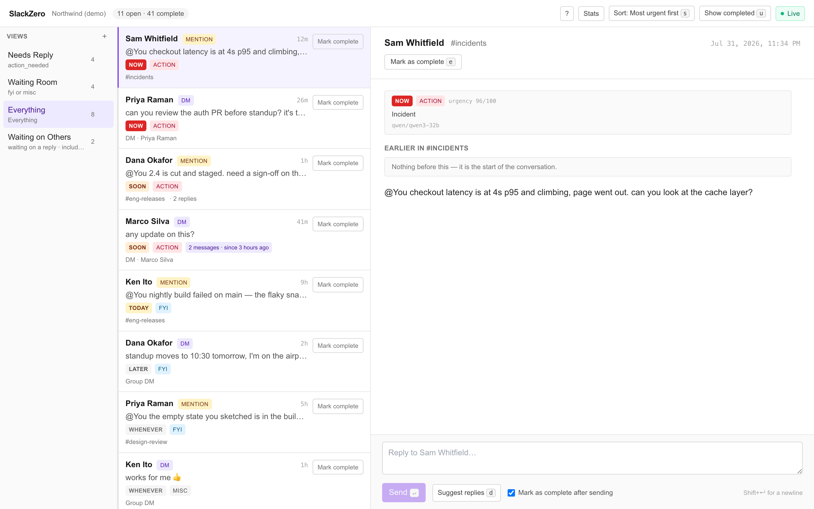
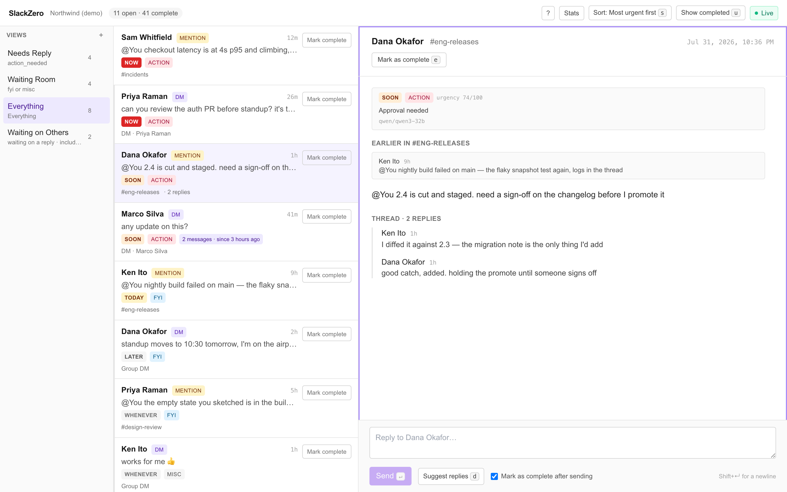
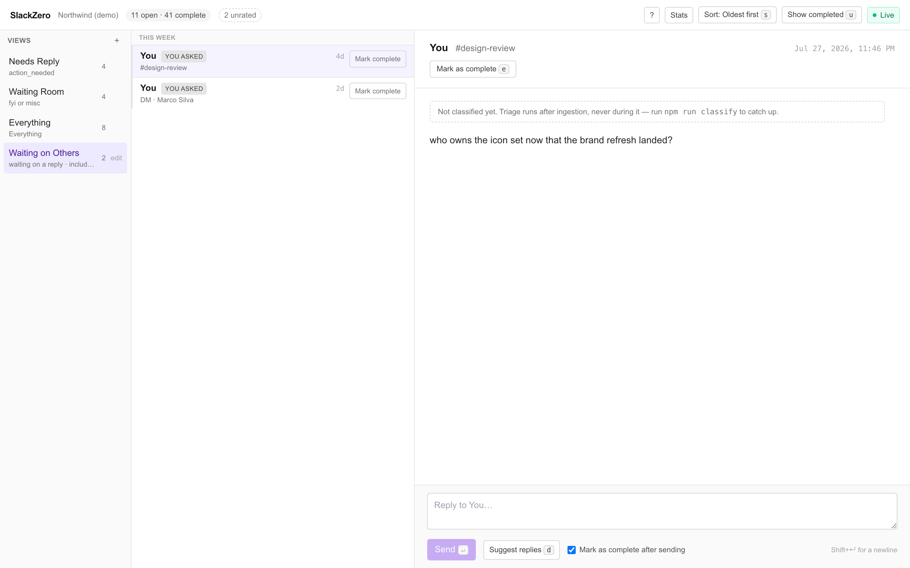
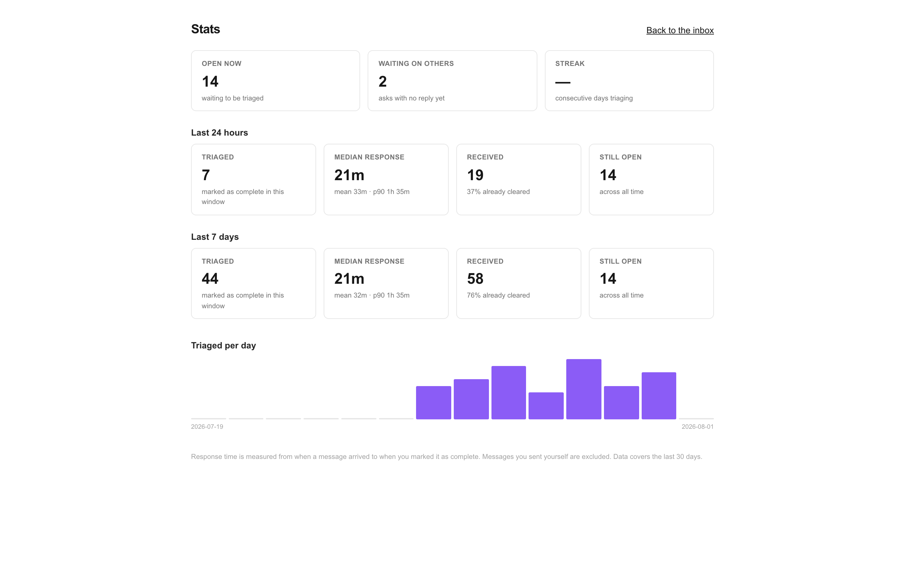
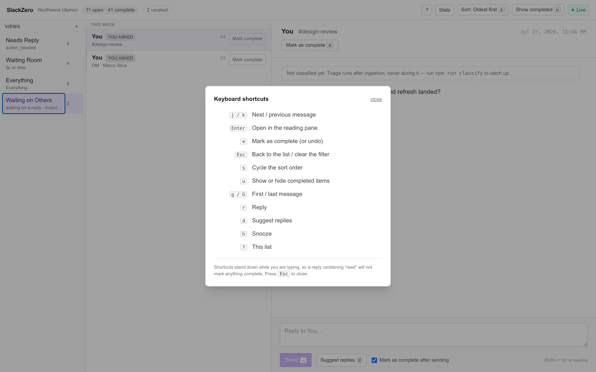

# SlackZero

A fast, keyboard-first Slack client for triaging DMs and notifications.
Superhuman, but for Slack instead of email.

It pulls your DMs, mentions and threads into one prioritized queue, classifies
each message with a small language model (urgency, action-vs-FYI-vs-misc, and
whether it is an "any update on this?" bump), and lets you fly through the queue
with `j`/`k`/`e` without touching the mouse.

Built for [Hack Club Horizons](https://guides.horizons.hackclub.com/). Runs
locally — single-user, no hosted service, no telemetry, and no message content
in the database.



## Why I built it

Slack is where work arrives and also where it goes to die. Everything is a red
badge: an incident, "standup moved to 10:30", and a 👍 all look identical, so
"catch up on Slack" means re-reading a day of noise to find the three things
that actually needed you. Email solved this — Superhuman made triage fast and
keyboard-driven — and nothing had done it for Slack.

So this is triage, not another Slack client. The queue is ordered by *how much
this needs you*, not by when it arrived; three "any update?" chases collapse
into one row dated to the original ask; and every urgency score comes with a
stored reason, so the ordering can be argued with rather than taken on faith.
The goal is to open Slack once, clear it, and leave.

## Try it without a Slack app

Demo mode runs the whole app against a seeded fake workspace: no Slack app, no
tokens, no network calls to Slack. It is the fastest way to see what the triage
queue actually does.

**With Docker (nothing else installed):**

```bash
docker compose -f docker-compose.demo.yml up --build
```

Then open <http://localhost:7001> and click **Enter the demo**.

**With the repo checked out and Node 20+:**

```bash
npm install
npm run demo:setup     # creates + migrates + seeds a throwaway demo database
npm run demo           # http://localhost:3000
```

Demo mode is off unless `SLACKZERO_DEMO=1`, and it refuses to start on a
database that holds a real Slack installation — it signs a visitor in without
Slack, so it must never be reachable on a connected install. Replies are
inert in the demo: there is no token, so there is nothing to send with.

## Screenshots

| | |
| --- | --- |
| **Reading pane** — the message, its thread, what came before it, and why the model scored it that way.<br><br> | **Waiting on Others** — asks *you* sent that nobody has answered, oldest first.<br><br> |
| **Stats** — median response time, triaged-per-day, current streak.<br><br> | **Shortcuts** — press `?` anywhere in the inbox.<br><br> |

## How it works

```
Slack  ──Socket Mode / Web API──►  ingest  ──►  Postgres (identities + state)
                                                   │
                                    classify (Hack Club AI, qwen3-32b)
                                                   │
                                                   ▼
                                    queue: group → score → sort → filter
                                                   │
                                    render  ◄── message text fetched live
```

1. **Ingest.** OAuth connects one workspace. A backfill pulls recent unread
   DMs, group DMs, mentions and relevant thread replies; Socket Mode streams
   new ones live, so no public URL is ever needed. Raw Slack payloads are
   normalized at this boundary and never reach the UI.
2. **Store routing facts, not content.** Postgres holds message *identities*
   (conversation, timestamp, sender) plus our own state: classification, done,
   snooze, waiting-on. Message text is never written to the database — it is
   fetched from Slack at render time and cached in memory. Slack stays the
   source of truth for what was said; we own the triage layer on top.
3. **Classify, asynchronously.** A small open-weight model
   (`qwen/qwen3-32b`, via Hack Club AI) scores urgency 0-100 and assigns
   `action_needed` / `fyi` / `misc`, plus a structured reason code, per
   message. Classification never blocks ingestion, and a message that has not
   been classified still shows up — just unsorted. A small model on purpose:
   this is per-message, high-volume work, and a frontier model here would be a
   waste of money.
4. **Group before ranking.** Six messages from one person in a row are one
   task, so they collapse into one row. A chase ("any update on this?") is
   detected and folded into the *original* ask, keeping the original
   timestamp — so chasing surfaces staleness instead of faking new activity.
5. **Filter and sort.** Saved views are filter sets (category, source, VIP,
   bumped, urgency floor) plus a sort. `s` cycles the sort; the header always
   names the order the list is actually in.
6. **Act without leaving the queue.** Reply inline (optionally from an AI
   draft), snooze, or mark complete — all from the keyboard.

## Features

- **Unified queue** — DMs, mentions, and threads you are part of, in one list,
  updating live: a message arriving over Socket Mode or a snooze elapsing shows
  up on its own, with no reload and without losing your place. The header says
  `Live` while the connection is up, and `Offline` when it is not.
- **AI triage** — urgency 0-100, `action_needed` / `fyi` / `misc`, and a stored
  reason for every score.
- **Bump collapsing** — a three-message "any update?" chain shows as one row at
  the *original* ask's timestamp.
- **Saved views** — Needs Reply, Waiting Room, Everything, Waiting on Others,
  plus any filter set you build.
- **Conversation context** — DMs and mentions open with the ten messages that
  came before, both halves of the exchange, and scroll further back on demand.
- **Reply without leaving the queue** — inline compose, optional AI drafts,
  auto-mark-as-complete.
- **Snooze** — later today / tomorrow / next week / custom, waking early if the
  thread sees new activity before then. A woken reminder still says it was one,
  and why it came back.
- **Waiting on others** — asks you sent that nobody has answered, with a
  staleness indicator.
- **Stats** — median response time, triaged-per-day, streak, at `/stats`.

## Keyboard shortcuts

Press `?` in the inbox for the full list. The short version:

| Key | Action |
| --- | --- |
| `j` / `k` | Next / previous message |
| `Enter` | Open in the reading pane |
| `e` | Mark as complete (or undo) |
| `r` | Reply |
| `d` | Suggest replies |
| `h` | Snooze |
| `u` | Show or hide completed items |
| `s` | Cycle the sort order |
| `g` / `G` | First / last message |
| `Esc` | Back / clear the filter |
| `?` | This list |

Shortcuts stand down while you are typing, so a reply containing "read" will not
mark anything complete.

To narrow the queue to one conversation, use `/inbox?in=<channel-name>` (or a
conversation id). `Esc` widens back out.

## Connecting your own Slack workspace

Requirements: Node 20+, Docker (for local Postgres), a Slack workspace you can
install an app into (**use a test workspace, not production**), and optionally a
[Hack Club AI](https://ai.hackclub.com) key — the app runs without one, it just
will not classify.

```bash
npm install
docker compose up -d          # Postgres on host port 5433
cp .env.example .env          # then fill it in — see below
npx prisma migrate dev
```

**Create the Slack app and fill in `.env`** by following
[`SLACK_APP_SETUP.md`](./SLACK_APP_SETUP.md). It covers the scopes, Socket Mode,
the redirect URL, and the two traps that cost the most time here: a dev server
that silently falls back to plain HTTP, and ISP filters that block ngrok.

Then connect the workspace:

```bash
npm run dev:https             # https://localhost:3000
```

Open <https://localhost:3000>, click through the certificate warning, and hit
**Connect Slack**. Confirm all three checks are green at
<https://localhost:3000/api/health>. Connecting automatically imports up to ten
unread messages per DM or group DM, plus mentions and relevant thread replies.

Slack OAuth *is* the login: completing it as the owner sets the session cookie.
Set `SLACK_OWNER_USER_ID` so only your Slack account can sign in.

### Refreshing your messages

The initial import runs during OAuth. These refresh or verify it later:

```bash
npm run backfill              # pull recent unread DMs/mpims and mentions
npm run backfill:verify       # re-count against Slack, independently
npm run classify              # classify anything not yet rated
```

Optional background jobs, each safe to run or skip:

```bash
npm run socket                # live ingestion over Socket Mode
npm run snooze:sweep          # reinject snoozed items while the app is open
npm run waiting:scan          # find asks nobody has answered
```

## Tech stack

- **Next.js 14** (App Router), TypeScript strict, Tailwind — server actions and
  route handlers for anything touching Slack or the LLM, so no token ever
  reaches the browser.
- **Postgres via Prisma** — a metadata and state layer only; Slack owns the
  content.
- **Slack Web API** for reads and writes, **Socket Mode** for live events, so a
  local install needs no public URL or tunnel.
- **Hack Club AI** (`qwen/qwen3-32b`) behind a single module,
  `src/lib/llm/client.ts` — nothing else imports a provider SDK, so the model is
  swappable in one file.
- **Vitest** (673 unit tests) and **Playwright** (54 e2e tests).

## Development

```bash
npm run test                  # unit tests (no network, no database)
npm run test:e2e              # Playwright
npm run typecheck
npm run lint
```

The e2e suite seeds its own fixtures in an id namespace that cannot collide with
real Slack ids, and runs single-worker because every spec shares one local
Postgres. It builds into `.next-e2e` so it cannot clobber a running dev server.

Two evaluation harnesses make live LLM calls (never Slack calls):

```bash
npm run triage:eval           # classification accuracy vs the labeled set
npm run draft:eval            # what the reply drafts actually look like
```

**Re-run `draft:eval` after editing the drafting prompt.** A longer prompt makes
the model reason more, which eats the `max_tokens` budget and can truncate the
response to nothing — see the note on `DRAFT_MAX_TOKENS` in
`src/lib/reply/draft.ts`.

Screenshots in this README are generated, not hand-cropped:

```bash
npm run demo:setup && npm run demo     # then, in another terminal:
npm run screenshots
```

### Privacy migration routing repair

After deploying the privacy-first migrations, run `npm run backfill`. This is
required for a local database that previously applied the early privacy
migration (or any interrupted legacy rollout): Slack is re-read to repair only
the persisted `isContent` and `mentionsAuthedUser` routing facts. Message
content remains live-only and is never restored to Postgres.

### Cutting a release

```bash
npm run package:release       # dist/slackzero-v<version>.zip, from git HEAD
```

See [`RELEASE.md`](./RELEASE.md) for what ships in it and how to publish.

## Known limitations

See [`KNOWN_ISSUES.md`](./KNOWN_ISSUES.md). The short version: urgency scores are
not reproducible run-to-run, "answered" is detected structurally rather than
semantically, and a few ingestion paths have only fixture coverage.

Deliberately out of scope: multi-tenant auth, a hosted service, and mobile.
This is a single-user local tool.

## Project notes

`plan.md` records what was built in each phase, what was verified, and the
judgment calls made along the way. `CLAUDE.md` holds the working conventions.

Licensed under the [MIT License](./LICENSE).
